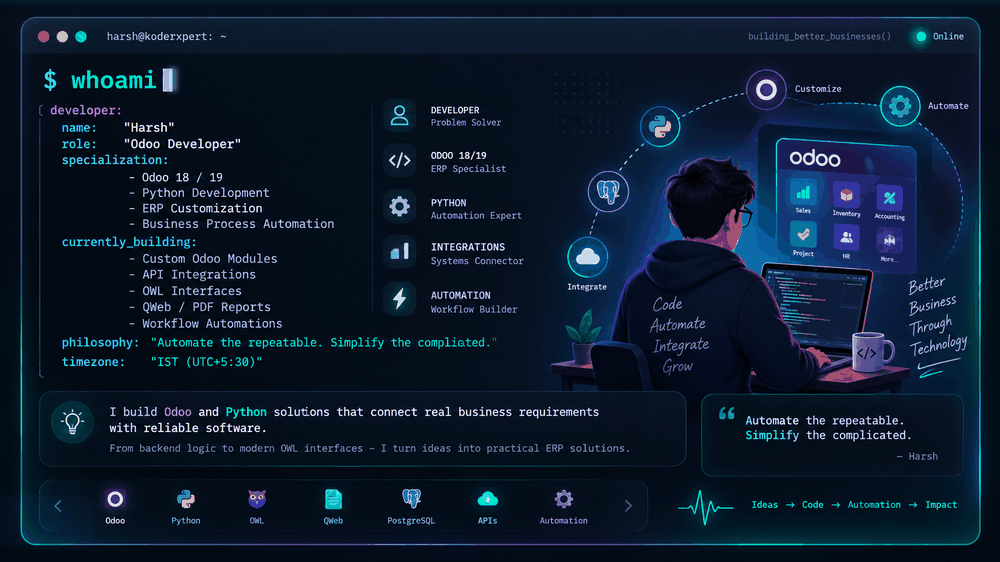

<!-- 

  

  -->

  

 

👋 About Me

I build Odoo and Python solutions that connect real business requirements with reliable software.

My work focuses on custom ERP development, workflow automation, API integrations, migrations, reporting, and modern Odoo interfaces — from backend business logic to OWL components and production-ready QWeb reports.

⚡ What I Do

<table>
<tr>
<td width="50%" valign="top">

<h3>🧩 Odoo Engineering</h3>

• Custom Odoo modules 
• Odoo 18 / 19 development 
• ORM models & business logic 
• Sales, Inventory, Accounting & Project 
• Access rights & record rules 
• Automated actions & workflows 
• Module migrations & upgrades

</td>
<td width="50%" valign="top">

<h3>🔌 Automation & Integrations</h3>

• REST API integrations 
• Third-party service integrations 
• WhatsApp / Meta API 
• Data synchronization 
• Business process automation 
• Import & migration utilities 
• PostgreSQL-backed workflows

</td>
</tr>

<tr>
<td width="50%" valign="top">

<h3>🎨 Odoo Frontend</h3>

• OWL / JavaScript 
• XML views & QWeb templates 
• Custom widgets & components 
• Responsive Odoo UI 
• Legacy frontend migrations 
• Website & eCommerce customization

</td>
<td width="50%" valign="top">

<h3>📊 Reports & Data</h3>

• Custom QWeb PDF reports 
• Invoice & sales reports 
• Multilingual report layouts 
• Operational dashboards 
• PostgreSQL queries 
• Python data processing

</td>
</tr>
</table>

🚀 Selected Engineering Work

<table>
<tr>
<td width="33%" valign="top" align="center">

🧱 Custom ERP Modules

Business-focused Odoo modules with clean models, security, workflows, and maintainable architecture.

</td>
<td width="33%" valign="top" align="center">

🦉 OWL Modernization

Migration of legacy frontend behavior to modern OWL patterns for Odoo 18/19.

</td>
<td width="33%" valign="top" align="center">

💬 Meta / WhatsApp

Integration workflows using Meta APIs for messaging and business communication.

</td>
</tr>

<tr>
<td width="33%" valign="top" align="center">

🧾 QWeb Reporting

Custom invoice, sale, multilingual, PDF, and operational reporting.

</td>
<td width="33%" valign="top" align="center">

🗓️ Project Automation

Task scheduling, forecast logic, dependencies, validations, and timesheet workflows.

</td>
<td width="33%" valign="top" align="center">

🔁 Data & Integrations

Data migration, model restructuring, REST APIs, and system synchronization.

</td>
</tr>
</table>

🛠️ Technology Stack

Core Development

  

Tools & Infrastructure

  

Odoo Ecosystem

🧠 Current Focus

📈 GitHub Activity

<picture>
  <source media="(prefers-color-scheme: dark)" srcset="https://streak-stats.demolab.com/?user=ham-koderxpert&theme=dark&hide_border=true&background=00000000&ring=14B8A6&fire=14B8A6&currStreakLabel=5EEAD4" />
  <source media="(prefers-color-scheme: light)" srcset="https://streak-stats.demolab.com/?user=ham-koderxpert&theme=default&hide_border=true&background=00000000&ring=0F766E&fire=0F766E&currStreakLabel=0F766E" />
  
</picture>

If the activity graph service is unreliable, omit it. A clean profile is better than a broken widget.

🐍 Contribution Journey

<picture>
  <source media="(prefers-color-scheme: dark)" srcset="https://raw.githubusercontent.com/ham-koderxpert/ham-koderxpert/output/github-contribution-grid-snake-dark.svg" />
  <source media="(prefers-color-scheme: light)" srcset="https://raw.githubusercontent.com/ham-koderxpert/ham-koderxpert/output/github-contribution-grid-snake.svg" />
  
</picture>

🛰️ Current Mission

ODOO 19   •   ERP ARCHITECTURE   •   OWL   •   POSTGRESQL   •   API INTEGRATIONS   •   AUTOMATION

  

Build software around the business — not the business around the software.

🤝 Let's Build Something Useful

I’m interested in building Odoo customizations, integrations, automation solutions, and ERP tools that solve practical business problems.

<!-- Replace and uncomment when ready

-->

  

 

